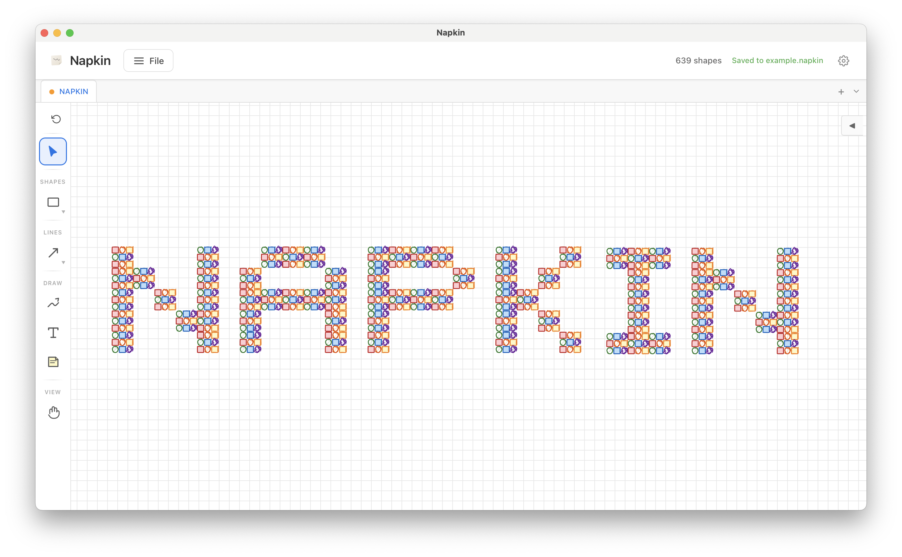

<p align="center">
  
</p>

<h1 align="center">Napkin</h1>

<p align="center">
  <em>From thought to diagram in seconds — entirely offline.</em>
</p>

<p align="center">
  A fast, local-first drawing and diagramming app. Sketch ideas, map out systems, and create diagrams — all without accounts, cloud sync, or network requests. Your data stays on your machine.
</p>

<p align="center">
  
</p>

**[Documentation](https://ipcrm.github.io/napkin/)**

## Getting started

Requires Node.js 18+ and Rust (for Tauri).

```bash
npm install
npm run tauri dev
```

To run in the browser only (no native features):

```bash
npm run dev
```

## MCP Server

Napkin includes a built-in [Model Context Protocol](https://modelcontextprotocol.io/) (MCP) server that lets AI agents create and manipulate diagrams programmatically.

### Enable

Start the server from **View → Start API Server** in the menu bar. The server listens on `http://127.0.0.1:21420/mcp` using JSON-RPC over HTTP POST.

### Claude Code configuration

Add to your `.claude.json` or MCP settings:

```json
{
  "mcpServers": {
    "napkin": {
      "type": "url",
      "url": "http://127.0.0.1:21420/mcp"
    }
  }
}
```

### Available tools

| Tool | Description |
|------|-------------|
| `get_canvas` | Get full canvas state (shapes, viewport, groups) |
| `list_shapes` | List all shapes, optionally filtered by type |
| `get_shape` | Get a single shape by ID |
| `create_shape` | Create a shape (rectangle, ellipse, triangle, diamond, hexagon, star, cloud, cylinder, sticky, text) |
| `update_shape` | Update properties of an existing shape |
| `delete_shape` | Delete a shape by ID |
| `create_image` | Add an image from URL or base64 data |
| `create_connection` | Create a bound arrow or line between two shapes |
| `set_viewport` | Pan and zoom the canvas |
| `select_shapes` | Select shapes by ID |
| `batch_operations` | Batch create/update/delete in one call |
| `list_tabs` | List all open tabs |
| `create_tab` | Create a new tab |
| `switch_tab` | Switch to a different tab |
| `rename_tab` | Rename a tab |
| `bring_to_front` | Move a shape to the top of the z-order |
| `send_to_back` | Move a shape to the bottom of the z-order |
| `bring_forward` | Move a shape one step forward in z-order |
| `send_backward` | Move a shape one step backward in z-order |
| `group_shapes` | Group shapes together |
| `ungroup` | Ungroup a shape group |
| `clear_canvas` | Clear all shapes from the canvas |

## Build

```bash
npm run tauri build
```

Produces `Napkin.app` and `.dmg` on macOS, `.msi`/`.exe` on Windows, and `.deb`/`.AppImage` on Linux in `src-tauri/target/release/bundle/`.

## License

[MIT](LICENSE)
